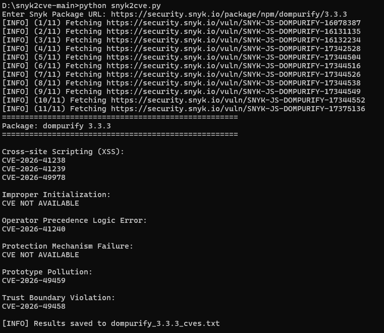
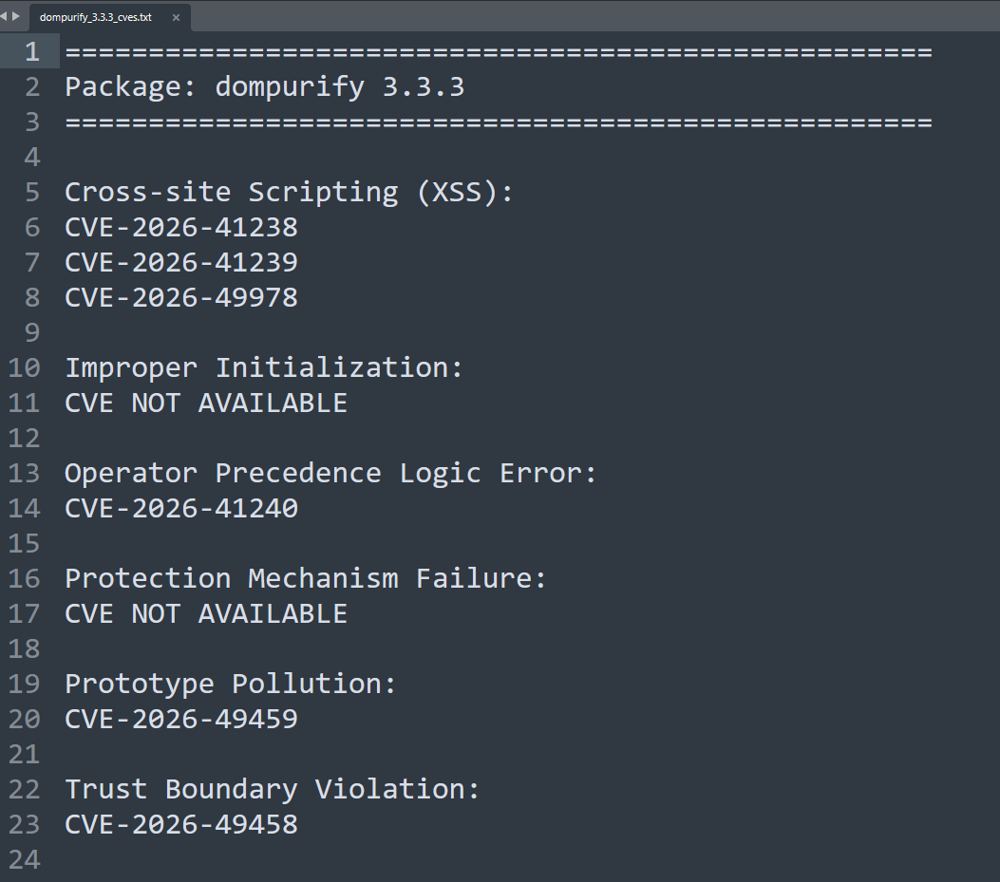

# snyk2cve

[]()
[]()
[]()
[]()
[]()

---

<p align="center">
Python CLI for Security Researchers • Pentesters • Developers
</p>

Python CLI to extract and group CVEs from Snyk package advisories.

The tool automatically discovers all advisories for a package, extracts associated CVEs, merges duplicate vulnerability names, and exports the results to a text file.

---

## Features

- Extracts CVEs from Snyk package pages
- Groups advisories by exact vulnerability name
- Merges duplicate CVEs
- Prints "No CVE" when applicable
- Automatic retry support
- Polite rate limiting
- No Selenium required
- Automatic output file generation

---

## Installation

Clone the repository

```bash
git clone https://github.com/parab500/snyk2cve.git
cd snyk2cve
```

Install dependencies

```bash
pip install -r requirements.txt
```

---

## Usage

Interactive mode

```bash
python3 snyk2cve.py
```

Command-line mode

```bash
python3 snyk2cve.py https://security.snyk.io/package/npm/axios/0.21.4
```

---

## Screenshot

<p align="center">
  
  
</p>

---

## Example Output

```text
====================================================

Package: axios 0.21.4

====================================================

Prototype Pollution:
CVE-2026-44495

Server-side Request Forgery (SSRF):
CVE-2020-28168
CVE-2024-39338

Cross-site Request Forgery (CSRF):
No CVE
```

---

## Output File

The tool automatically creates

```
axios_0.21.4_cves.txt
```

---

## Requirements

- Python 3.10+
- requests
- beautifulsoup4
- lxml
- urllib3

---

## Disclaimer

This project is intended for educational, research, and defensive security purposes.

Please respect Snyk's Terms of Service and avoid excessive automated requests.

---

## License

MIT License
